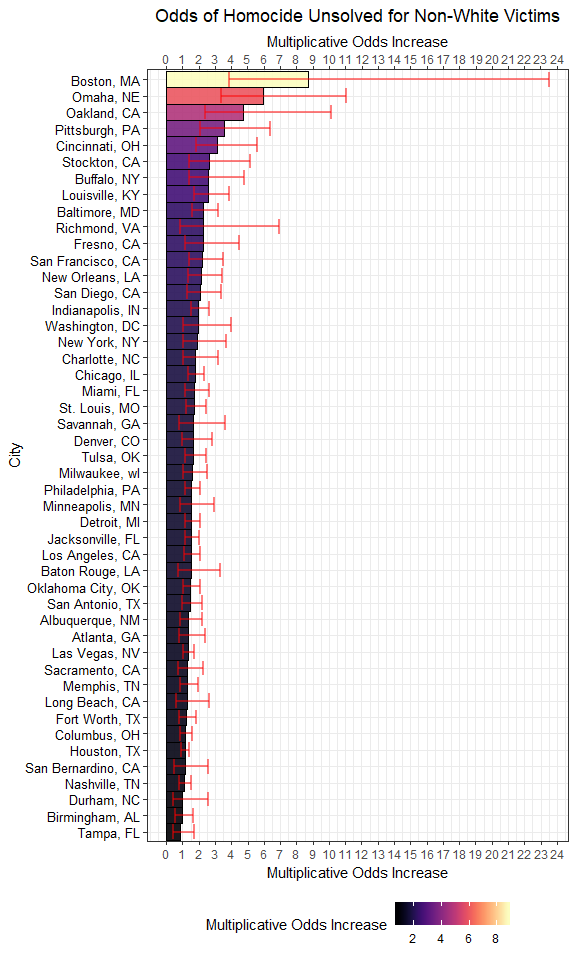
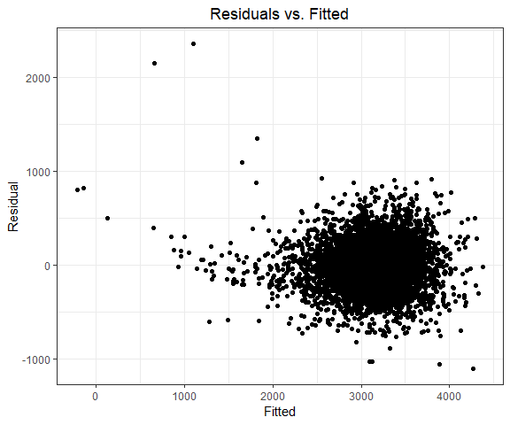
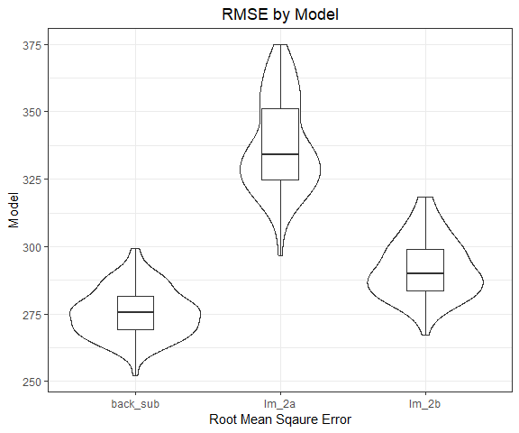

P8105 Homework 6
================
Quinton Neville
November 20, 2018

Problem 1
=========

``` r
#Read in the wp homicide data
wp.homicide.df <- read_csv("./data/wp_homicide_data.csv")

#Snag Dimensions and summary
dim.wp.df <- dim(wp.homicide.df)

#Unique City/State locations
unique.locations <- wp.homicide.df %>% distinct(., city, state) %>% nrow() 

#New city_state variable, filtering, and mutating
wp.homicide.df <- wp.homicide.df %>%
  mutate(
    city_state = str_c(city, state, sep = ", "), 
    unsolved = ifelse(disposition == "Closed without arrest" | disposition == "Open/No arrest", TRUE, FALSE)
  ) %>% select(city_state, everything()) %>%
  filter(city_state != "Dallas, TX" & city_state != "Phoenix, AZ" &
         city_state != "Kansas City, MO" & city_state != "Tulsa, AL") %>%
  mutate(
    victim_race = ifelse(victim_race == "White", "white", "non-white"), 
    victim_race = as.factor(victim_race) %>% fct_relevel(., "white", "non-white"),
    victim_age = parse_number(victim_age)
  )
```

``` r
#GLM model Baltimore
baltimore.glm <- wp.homicide.df %>% group_by(city_state) %>% nest() %>% filter(city_state == "Baltimore, MD") %>%
  mutate(glm_model = map(data, ~glm(unsolved ~ victim_age + victim_sex + victim_race, data = .x, family = "binomial")),
         conf_int = map(.x = glm_model, ~confint_tidy(.x, conf.level = 0.95)),
         glm_model = map(glm_model, ~broom::tidy(.x))) %>%
  unnest(., glm_model, conf_int) %>%
  filter(term == "victim_racenon-white") %>%
  select(city_state, estimate, conf.low, conf.high) %>%
  gather(key = type, value = numeric, estimate:conf.high) %>%
  mutate(numeric = exp(numeric))

#GLM all Cities
all.city.glm <- wp.homicide.df %>% group_by(city_state) %>% nest() %>%
  mutate(glm_model = map(data, ~glm(unsolved ~ victim_age + victim_sex + victim_race, data = .x, family = "binomial")),
         conf_int = map(.x = glm_model, ~confint_tidy(.x, conf.level = 0.95)),
         glm_model = map(glm_model, ~broom::tidy(.x))) %>%
  unnest(., glm_model, conf_int) %>%
  filter(term == "victim_racenon-white") %>%
  select(city_state, estimate, conf.low, conf.high) %>%
  mutate(city_state = as.factor(city_state) %>% fct_reorder(., estimate, .desc = FALSE)) %>%
  gather(key = type, value = numeric, estimate:conf.high) %>%
  mutate(numeric = exp(numeric)) %>%
  spread(type, numeric)
```

``` r
all.city.glm %>%
  ggplot(aes(x = city_state, y = estimate, fill = estimate)) +
  geom_bar(stat = "identity", colour = "black", width = 1, alpha = 0.9) +
  geom_errorbar(aes(x = city_state, ymin = conf.low, ymax = conf.high), colour = "red", size = .9, alpha = 0.5) +
  coord_flip() +
  viridis::scale_fill_viridis(
    option = "magma",
    name = "Multiplicative Odds Increase", 
    discrete = FALSE
  ) +
  labs(
    x = "City",
    y = "Multiplicative Odds Increase",
    title = "Odds of Homocide Unsolved for Non-White Victims"
  ) +
    theme(legend.position = "bottom",
        axis.text.y = element_text(color = "black", 
        size = 10,  hjust = 1) ) +
  scale_y_continuous(breaks = seq(0, 24, 1), sec.axis = dup_axis())
```



Problem 2
=========

``` r
child.bw.df <- read_csv("./data/birthweight.csv") %>%
  janitor::clean_names() %>%
  mutate(
    babysex = ifelse(babysex == 1, "Male", "Female") %>% as.factor(),
    frace = as.factor(frace),
    mrace = as.factor(mrace),
    malform = ifelse(malform == 1, TRUE, FALSE)
  ) %>%
  select(bwt, everything())

#Check NA
missing_vec <- apply(child.bw.df, 2, function(x) {sum(is.na(x))})
```

#### Modeling

``` r
#Subset LM Selection (AIC)
mult.fit <- lm(bwt ~ ., data = child.bw.df)
back.sub.formula <- step(mult.fit, direction = 'backward')$terms
back.sub.mod <- lm(back.sub.formula, data = child.bw.df) 
```

``` r
back.sub.mod %>% broom::tidy() %>%
  knitr::kable()
```

| term        |       estimate|    std.error|   statistic|    p.value|
|:------------|--------------:|------------:|-----------:|----------:|
| (Intercept) |  -6070.2638943|  136.9081478|  -44.338222|  0.0000000|
| babysexMale |    -28.5580171|    8.4548958|   -3.377690|  0.0007374|
| bhead       |    130.7770408|    3.4465672|   37.944144|  0.0000000|
| blength     |     74.9471109|    2.0190479|   37.120027|  0.0000000|
| delwt       |      4.1067316|    0.3920592|   10.474775|  0.0000000|
| fincome     |      0.3180229|    0.1747477|    1.819898|  0.0688436|
| gaweeks     |     11.5924873|    1.4620657|    7.928842|  0.0000000|
| mheight     |      6.5940377|    1.7848817|    3.694383|  0.0002231|
| mrace2      |   -138.7924801|    9.9070869|  -14.009414|  0.0000000|
| mrace3      |    -74.8867755|   42.3146313|   -1.769761|  0.0768374|
| mrace4      |   -100.6781427|   19.3246910|   -5.209819|  0.0000002|
| parity      |     96.3046933|   40.3362158|    2.387549|  0.0170038|
| ppwt        |     -2.6755853|    0.4273585|   -6.260752|  0.0000000|
| smoken      |     -4.8434197|    0.5855757|   -8.271210|  0.0000000|

``` r
child.bw.df %>%
  add_residuals(back.sub.mod) %>%
  add_predictions(back.sub.mod) %>%
  ggplot(aes(x = pred, y = resid)) +
  geom_point() +
  labs(
    x = "Fitted",
    y = "Residual",
    title = "Residuals vs. Fitted"
  )
```



#### Comparing Models

Given our selected model above, we will fit two alternative linear models for birthweight - Baby length at birth and gestational age as predictors - Baby head circumference, length at birth, and sex; using all possible interactions.

We will compare our model with these two alternatives using 10-fold Cross validation with MSE as the predictive quantity to minimize.

``` r
mod.2a <- child.bw.df %>% lm(bwt ~ blength + gaweeks, data = .)
mod.2a %>% broom::tidy() %>% knitr::kable()
```

| term        |     estimate|  std.error|  statistic|  p.value|
|:------------|------------:|----------:|----------:|--------:|
| (Intercept) |  -4347.66707|  97.958360|  -44.38281|        0|
| blength     |    128.55569|   1.989891|   64.60439|        0|
| gaweeks     |     27.04673|   1.717930|   15.74379|        0|

``` r
mod.2b <- child.bw.df %>% lm(bwt ~ bhead * babysex + bhead * blength + blength * babysex + bhead * babysex * blength, data = .)
mod.2b %>% broom::tidy() %>% knitr::kable()
```

| term                      |      estimate|     std.error|   statistic|    p.value|
|:--------------------------|-------------:|-------------:|-----------:|----------:|
| (Intercept)               |   -801.948671|  1102.3077046|  -0.7275180|  0.4669480|
| bhead                     |    -16.597546|    34.0916082|  -0.4868514|  0.6263883|
| babysexMale               |  -6374.868351|  1677.7669213|  -3.7996150|  0.0001469|
| blength                   |    -21.645964|    23.3720477|  -0.9261475|  0.3544209|
| bhead:babysexMale         |    198.393181|    51.0916850|   3.8830816|  0.0001047|
| bhead:blength             |      3.324444|     0.7125586|   4.6655020|  0.0000032|
| babysexMale:blength       |    123.772887|    35.1185360|   3.5244319|  0.0004288|
| bhead:babysexMale:blength |     -3.878053|     1.0566296|  -3.6702106|  0.0002453|

``` r
cv.df <- crossv_mc(child.bw.df, 100) %>%
  mutate(train = map(train, as.tibble),
         test = map(test, as.tibble)) %>%
  mutate(back_sub_lm = map(train, ~lm(back.sub.formula, data = .x)),
         lm_2a = map(train, ~lm(bwt ~ blength + gaweeks, data = .x)),
         lm_2b = map(train, 
                     ~lm(bwt ~ bhead * babysex + bhead * blength + blength * babysex + bhead * babysex * blength, data = .x))) %>%
  mutate(back_sub_rmse = map2_dbl(back_sub_lm, test, ~rmse(model = .x, data = .y)),
         lm_2a_rmse = map2_dbl(lm_2a, test, ~rmse(model = .x, data = .y)),
         lm_2b_rmse = map2_dbl(lm_2b, test, ~rmse(model = .x, data = .y)))
  
cv.df %>% 
  select(ends_with("rmse")) %>% 
  gather(key = model, value = rmse) %>% 
  mutate(model = str_replace(model, "_rmse", ""),
         model = fct_inorder(model)) %>% 
  ggplot(aes(x = model, y = rmse)) + 
  geom_violin() + 
  geom_boxplot(width = 0.25) +
  labs(
    x = "Root Mean Sqaure Error",
    y = "Model",
    title = "RMSE by Model"
  )
```


